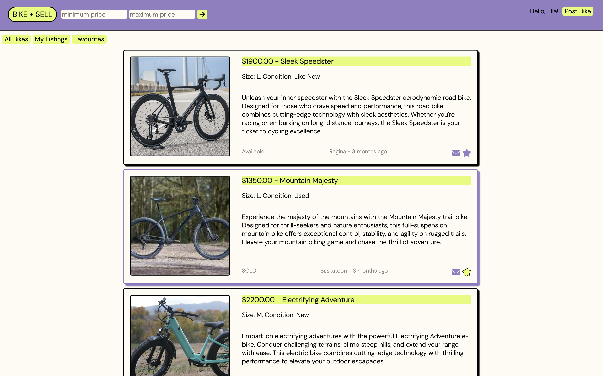
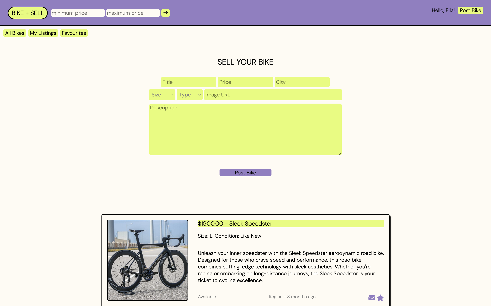

# Bike+Sell - Student Project README

Welcome to Bike+Sell, a student project developed by Janay Ma, Mohamed Elmi, Sam Sadeghi and Sofia Oliveira as a midterm assignment at the Lighthouse Labs Web Development Program.
Bike + Sell is a basic online marketplace designed exclusively for buying and selling bikes. Leveraging fundamental web technologies, we've created a simple platform that facilitates bike transactions and communication between buyers and sellers.

## Project Overview

Bike+Sell is a straightforward project that focuses on connecting bike enthusiasts who want to buy or sell bikes.

## Final Product:

Browse for bikes: 

Message Seller:

Post a bike for sale:

## Technologies Used

- **ES6 for Server-Side Code (NodeJS):** We've employed modern JavaScript features to develop the server-side code using NodeJS.

- **Express:** The project is built on the Express framework, enabling us to create essential backend APIs for handling bike-related functionalities.

- **RESTful Routes:** To maintain a structured API design, we've implemented RESTful routes to manage various endpoints efficiently.

- **SASS/UI Basics:** The user interface is designed with 'sassy' CSS styles to provide a clean, organized and simple layout for buying and selling bikes.

- **jQuery:** jQuery is used to add minimal interactivity to the user interface, enhancing the user experience.

- **PostgreSQL and pg:** Bike+Sell employs PostgreSQL as the database management system, with the pg library and promises for seamless database interactions.

- **Git:** We've adopted Git for version control, enabling collaborative development and easy tracking of code changes.

- **Twilio for Messaging:** The exclusive method of communication between users is through Twilio, which allows for text-based communication.

## Key Features

- **Bike Listings:** Users can list their bikes for sale, providing essential information like the bike's title, type, size and price.

- **Bike Search:** Buyers can browse through the available bike listings and search for bikes that match their preferences.

- **Text Messaging:** The only communication method is through Twilio's text messaging. Buyers and sellers can negotiate and inquire about bikes via text messages.

- **Simplicity:** The project's main focus is on providing a basic and user-friendly interface for buying and selling bikes, without unnecessary complexities.

## Project Setup

The following steps are only for _one_ of the group members to perform.

1. Create your own copy of this repo using the `Use This Template` button, ideally using the name of your project. The repo should be marked Public
2. Verify that the skeleton code now shows up in your repo on GitHub, you should be automatically redirected
3. Clone your copy of the repo to your dev machine
4. Add your team members as collaborators to the project so that they can push to this repo
5. Let your team members know the repo URL so that they use the same repo (they should _not_ create a copy/fork of this repo since that will add additional workflow complexity to the project)

## Getting Started

1. Create the `.env` by using `.env.example` as a reference: `cp .env.example .env`
2. Update the .env file with your correct local information 
  - username: `labber` 
  - password: `labber` 
  - database: `midterm`
3. Install dependencies: `npm i`
4. Fix to binaries for sass: `npm rebuild node-sass`
5. Reset database: `npm run db:reset`
  - Check the db folder to see what gets created and seeded in the SDB
7. Run the server: `npm run local`
  - Note: nodemon is used, so you should not have to restart your server
8. Visit `http://localhost:8080/`

## Warnings & Tips

- Do not edit the `layout.css` file directly, it is auto-generated by `layout.scss`.
- Split routes into their own resource-based file names, as demonstrated with `users.js` and `widgets.js`.
- Split database schema (table definitions) and seeds (inserts) into separate files, one per table. See `db` folder for pre-populated examples. 
- Use helper functions to run your SQL queries and clean up any data coming back from the database. See `db/queries` for pre-populated examples.
- Use the `npm run db:reset` command each time there is a change to the database schema or seeds. 
  - It runs through each of the files, in order, and executes them against the database. 
  - Note: you will lose all newly created (test) data each time this is run, since the schema files will tend to `DROP` the tables and recreate them.

## Dependencies

- Node 10.x or above
- NPM 5.x or above
- PG 6.x
